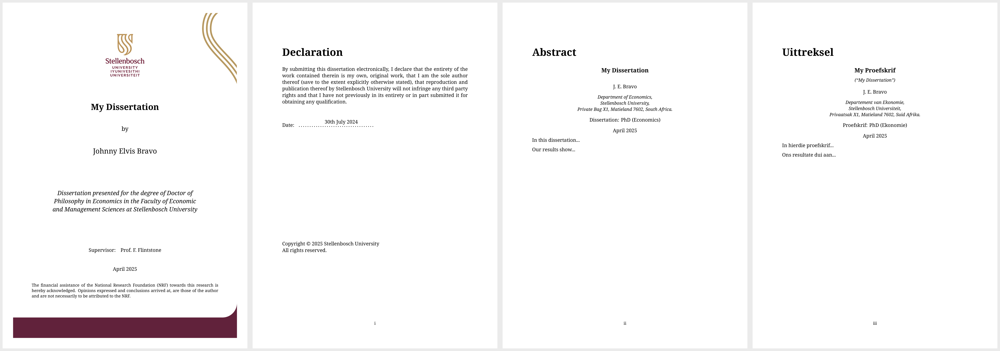
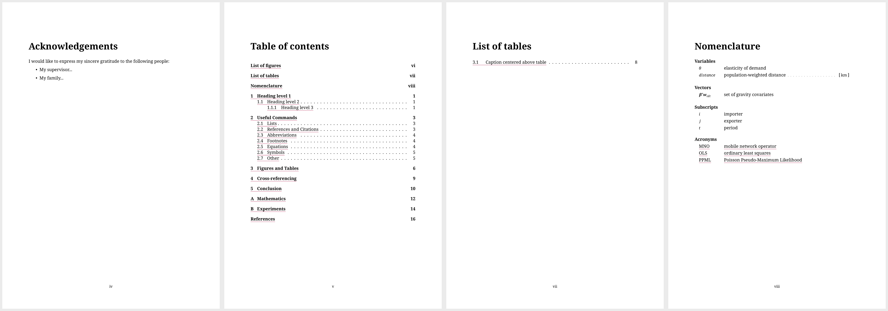

# wihantemplates

<!-- badges: start -->

[](https://lifecycle.r-lib.org/articles/stages.html#experimental)
<!-- badges: end -->

An R package–hopefully, one day–comprising a suite of templates for the
creation documents in **R Markdown** which I have come to use on a
regular basis. The package is still in its experimental stage and I’ll
be working out the kinks. The best way to contribute to its development
and address its inevitable problems is by logging a new issue
[here](https://github.com/WihanZA/wihantemplates/issues).

## Getting Started

You can install the development version from Github via the
[`remotes`](https://github.com/r-lib/remotes#readme) package in R.

``` r
# install.packages("remotes")
remotes::install_github("WihanZA/wihantemplates")
library(wihantemplates)
```

Also ensure that you have certain essential packages installed and
loaded in R. Since all templates rely on
[TinyTeX](https://yihui.org/tinytex/)’s custom LaTeX distribution, you
must have both the [`tinytex`](https://github.com/rstudio/tinytex)
package and distribution installed on your machine. The
[`rmarkdown`](https://github.com/rstudio/rmarkdown) package is also
included here for good measure.

``` r
if (!requireNamespace("tinytex", quietly = TRUE)) {
  install.packages("tinytex")
}
if (!requireNamespace("rmarkdown", quietly = TRUE)) {
  install.packages("rmarkdown")
}

library(tinytex)
library(rmarkdown)

if (!tinytex::is_tinytex() || is.null(tinytex::tinytex_root())) {
  tinytex::install_tinytex()
}
```

To ensure that all necessary LaTeX packages and dependencies are
available, especially those not included in the TinyTeX distribution by
default, you can use
[`tinytex::parse_install()`](https://yihui.org/tinytex/r/#compile-latex-documents).
This reads the `.log` file from a failed compilation, identifies the
missing packages and styles, and installs them.

``` r
tinytex::parse_install("dissertation.log")
```

Once the package has been installed, go to
`File > New File > R Markdown > From Template` in RStudio to select your
desired template. My templates are those denoted with `{wihantemplates}`
alongside templates’ names. For now, the package includes only the
`su_dissertation` template. Choose a name and location for the new
directory which contains the template, select `OK`, and you’ll be up and
running.

## `su_dissertation`

### Stellenbosch University Dissertation Template

All the necessary materials for doctoral and master’s students using R
Markdown to produce dissertations and theses conforming to the
requirements of Stellenbosch University. The template heavily relies on
the excellent suite of LaTeX packages,
[`stellenbosch-2`](https://ctan.org/pkg/stellenbosch-2), created and
maintained by [Daniel Els](mailto:dnjels@sun.ac.za). You can find a
complete example [here](examples/su_dissertation.pdf).

[](thumbnails/su_dissertation-1-2-3-4.png)
[](thumbnails/su_dissertation-5-6-8-9.png)
[](thumbnails/su_dissertation-10-19-21-25.png)

#### Template Directory

``` latex
[chosen-name]
├── cache
├── code
├── figures
├── matter
│   ├── abstract.Rmd
│   ├── acknowledgements.Rmd
│   ├── appendix.Rmd
│   ├── mybib.bib
│   └── nomenclature.Rmd
├── styles
│   ├── defaults.R
│   └── template.tex
├── [chosen-name].Rmd
```

- **`[chosen-name].Rmd`**: Your starting point and main interface for
  creating your dissertation. Generate your dissertation in PDF by
  clicking the `Knit` button or `Ctrl+Shift+K`.

- **`styles/template.tex`**: The backend of the template in LaTeX,
  extensively adapted from the `stb-thesis` LaTeX class. Novices should
  avoid editing this file unless confident in their TeX abilities.

- **`styles/defaults.R`**: Contains R code establishing the default
  settings for number printing, table output, and `ggplot` theme
  settings.

- **`cache`** and **`figures`**: Automatically created during the
  knitting process. The `cache` folder stores the cache for the R
  chunks, speeding up successive knitting, while the `figures` folder
  stores the figures generated by the R chunks. The paths for `cache`
  and `figures` are set in the `setup` code chunk in
  `[chosen-name].Rmd`.

- **`matter`**: Contains files called into the main `.Rmd` file,
  including `abstract.Rmd`, `acknowledgements.Rmd`, and
  `nomenclature.Rmd`. Although these are `.Rmd` files, they primarily
  consist of LaTeX code, so users should be aware of this when editing.
  You’ll find that they’re easy to use given the self-explanatory
  examples provided in the template. `appendix.Rmd` follows the same
  syntax as your main `.Rmd` file.

- **`matter/mybib.bib`**: The BibTeX file containing bibliography
  entries referenced in the main `.Rmd` file. I recommend using
  [Zotero](https://www.zotero.org/) to automatically export collections
  of bibliography entries to `matter/mybib.bib`.[^1]

#### YAML Fields

YAML fields are found at the beginning of your main `.Rmd` document.
These are metadata elements which define document settings and content
according to the specifications set out in `template.tex`. When you knit
the `.Rmd` file the final document is populated with the corresponding
information in the appropriate locations with the correct formatting.

``` yaml
---
output: 
  pdf_document:
    template: styles/template.tex
    keep_tex: TRUE
    latex_engine: xelatex
    citation_package: natbib
    pandoc_args: --top-level-division=chapter
thesistype: PhD
author: Johnny Elvis Bravo
authorshort: J.\ E.\ Bravo
title: My Dissertation
titel: My Proefskrif
degree: Doctor of Philosophy in Economics
graad: Doktor in die Wysbegeerte in Ekonomie
degreeshort: PhD (Economics)
graadshort: PhD (Ekonomie)
department: Department of Economics
departement: Departement van Ekonomie
faculty: Faculty of Economic and Management Sciences
fakulteit: Fakulteit Ekonomiese en Bestuurswetenskappe
supervisor: Prof.\ F.\ Flintstone
# cosupervisor: Prof.\ G.\ Jetson
year: 2025
month: 04
sponsor: The financial assistance of the National Research Foundation (NRF) towards this research is hereby acknowledged. Opinions expressed and conclusions arrived at, are those of the author and are not necessarily to be attributed to the NRF.
abstract: matter/abstract.Rmd
acknowledgements: matter/acknowledgements.Rmd
nomenclature: matter/nomenclature.Rmd
bibliography: matter/mybib.bib
colorlinks: TRUE
---
```

Fields containing `-short` are printed in the heading of the abstract to
provide a shortened version of their corresponding longer fields. The
Afrikaans equivalents of used in the Afrikaans abstract (“uittreksel”).
All Afrikaans fields are restricted to output in the Afrikaans abstract
or `uittreksel`. Fields on the front page include the full name of the
author, title, degree, department, faculty, supervisor, year, month, and
sponsor information.

- **keep_tex**: Keeps the intermediate `.tex` file. TRUE or FALSE.

- **thesistype**: Options for the `stb-thesis` class/style are specific
  formatting of the title and abstract pages of different document
  types. Options are `masters-a` (assignment master’s degree),
  `masters-t` (thesis master’s degree), and `PhD` (PhD dissertation).

- **author** (`authorshort`): The full name of the author for the front
  page and the short version for the abstract.

- **title** (`titel`): The dissertation title in English for the front
  page.

- **degree** (`graad`): The full name of the degree in English for the
  front page.

- **department** (`departement`): The full name of the department in
  English for the front page.

- **faculty** (`fakulteit`): The full name of the faculty in English for
  the front page.

- **supervisor**: Name of the supervisor for the front page.
  `cosupervisor` is optional and can be commented out if not needed.

- **year** and **month**: Specify the year and month of submission for
  both the front page and the abstract.

- **sponsor**: Acknowledges any financial assistance or sponsorship. It
  is optional and can be commented out if not needed. This appears on
  the front page.

- **File paths**: `abstract` is the path to the `abstract.Rmd` file,
  `acknowledgements` is the path to the `acknowledgements.Rmd` file,
  `nomenclature` is the path to the `nomenclature.Rmd` file,
  `bibliography` is the path to the BibTeX file containing bibliography
  entries, and `template` is the path to the LaTeX template file.

- **Fields to avoid deviating from**: `latex_engine` (specifies the
  LaTeX engine to use, here `xelatex`), `citation_package` (specifies
  the citation package to use, here `natbib`), and `pandoc_args`
  (additional arguments for Pandoc, setting the top-level division to
  chapter).[^2]

- **colorlinks**: Specifies if the links in the PDF will be colored. You
  can set colors for links, citations, files, and URLs. For example,
  setting `colorlinks` to `true` will enable colored links.

- **Fields to avoid deviating from**: `latex_engine` (specifies the
  LaTeX engine to use, here `xelatex`), `citation_package` (specifies
  the citation package to use, here `natbib`), and `pandoc_args`
  (additional arguments for Pandoc, setting the top-level division to
  chapter).[^3]

[^1]: See **[Better
    BibTeX](https://retorque.re/zotero-better-bibtex/)**, **[Citations
    in R Markdown’s Visual
    Mode](https://rstudio.github.io/visual-markdown-editing/citations.html)**,
    and **[ZotFile](https://zotfile.com/)** for additional tools making
    citation and reference management easier.

[^2]: If for some reason you decide to delete
    `citation_package = natbib`, you will receive an error along the
    lines of
    `! Package natbib Error: Bibliography not compatible with author-year citations.`

[^3]: If for some reason you decide to delete
    `citation_package = natbib`, you will receive an error along the
    lines of
    <span style="color: red;">`! Package natbib Error: Bibliography not compatible with author-year citations.`</span>
