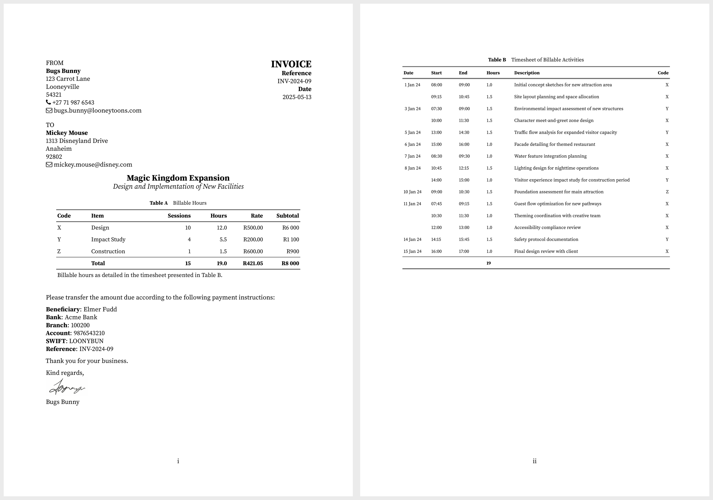

# wihantemplates

<!-- badges: start -->
<!-- badges: end -->

An R package providing a suite of professional templates for document creation in **R Markdown**.
Designed for academic and professional document workflows, these templates streamline the production of dissertations, invoices, and manuscripts with consistent, high-quality formatting.

## Getting Started

### Installation

Install the development version from GitHub using the [`remotes`](https://github.com/r-lib/remotes#readme) package:

```r
# install.packages("remotes")
remotes::install_github("WihanZA/wihantemplates")
library(wihantemplates)
```

### Prerequisites

Since all templates produce PDF documents, you'll need a TeX distribution installed.
I recommend the lightweight [TinyTeX](https://yihui.org/tinytex/) distribution.
Install both the [`tinytex`](https://github.com/rstudio/tinytex) R package and the TinyTeX distribution with:

```r
if (!requireNamespace("tinytex", quietly = TRUE)) {
  install.packages("tinytex")
}
if (!requireNamespace("rmarkdown", quietly = TRUE)) {
  install.packages("rmarkdown")
}

library(tinytex)
library(rmarkdown)

if (!tinytex::is_tinytex() || is.null(tinytex::tinytex_root())) {
  tinytex::install_tinytex()
}
```

### LaTeX Dependencies

To ensure all necessary LaTeX packages are available, use [`tinytex::parse_install`](https://yihui.org/tinytex/r/#compile-latex-documents) when you encounter missing packages.
This function reads the `.log` file from a failed compilation, identifies missing packages, and installs them automatically:

```r
tinytex::parse_install("dissertation.log")
```

### Using the Templates

After installation:

1. Go to `File > New File > R Markdown > From Template` in RStudio
2. Select your desired template (marked with `{wihantemplates}`)
3. Choose a name and location for the new directory
4. Click `OK` to create the template

## Templates

### Dissertation

**Stellenbosch University Dissertation Template**

Create professional dissertations and theses conforming to Stellenbosch University requirements.
Features include:

- Structured directory organization
- Customizable YAML fields for metadata
- Bilingual support for English and Afrikaans content
- Proper formatting for abstracts, acknowledgements, chapters, and references
- Built on the [`stellenbosch-2`](https://ctan.org/pkg/stellenbosch-2) LaTeX package

[](thumbnails/dissertation-1-2-3-9.png)

### Invoice

**Professional Invoice Template**

Generate polished, professional invoices with precision and ease.
Features include:

- Customizable fields for client and author information
- Timesheet data integration and processing
- Automatic calculation of billable amounts
- Professional formatting with optional signature
- Banking and payment details section

[](thumbnails/invoice-1-2.png)

### Manuscript

**Academic Manuscript Template**

Produce publication-ready academic manuscripts with professional formatting.
Features include:

- Proper structure for sections, equations, tables, and figures
- Support for citations and cross-references
- Footnotes and acronyms handling
- Clean typography with sensible defaults
- LaTeX-based PDF output

[](thumbnails/manuscript-1-2-3.png)

## Contributing

Feedback and contributions are welcome! Please log issues or suggest improvements on the [GitHub repository](https://github.com/WihanZA/wihantemplates/issues).