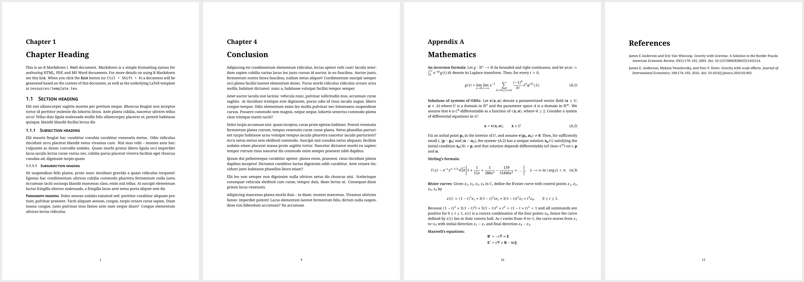

# wihantemplates

<!-- badges: start -->

[](https://github.com/WihanZA/wihantemplates/actions/workflows/r-cmd-check.yaml)
[](https://github.com/WihanZA/wihantemplates/actions/workflows/styler.yaml)
[](https://CRAN.R-project.org/package=wihantemplates)
<!-- badges: end -->

An R package comprising–hopefully, one day–a suite of templates for the
creation documents in **R Markdown** which I’ve come to use on a regular
basis. The package is still in its experimental stage and I’ll be
working out the kinks. The best way to contribute to its development and
address its inevitable problems is by logging a new issue
[here](https://github.com/WihanZA/wihantemplates/issues).

## Getting Started

You can install the development version from this Github repository via
the [`remotes`](https://github.com/r-lib/remotes#readme) package in R.

``` r
# install.packages("remotes")
remotes::install_github("WihanZA/wihantemplates")
library(wihantemplates)
```

You should ensure that certain essential packages are installed and
loaded in R. Since all templates produce PDFs, you’ll need a TeX
distribution installed on your machine. I recommend using the
lightweight TeX installation [TinyTeX](https://yihui.org/tinytex/).
Follow the steps below to have both the
[`tinytex`](https://github.com/rstudio/tinytex) package and distribution
in place. The [`rmarkdown`](https://github.com/rstudio/rmarkdown)
package is also included here for good measure.

``` r
if (!requireNamespace("tinytex", quietly = TRUE)) {
  install.packages("tinytex")
}
if (!requireNamespace("rmarkdown", quietly = TRUE)) {
  install.packages("rmarkdown")
}

library(tinytex)
library(rmarkdown)

if (!tinytex::is_tinytex() || is.null(tinytex::tinytex_root())) {
  tinytex::install_tinytex()
}
```

To ensure that all necessary LaTeX packages and dependencies are
available, especially those not included in the TinyTeX distribution by
default, you can use
[`tinytex::parse_install`](https://yihui.org/tinytex/r/#compile-latex-documents).
This reads the `.log` file from a failed compilation, identifies the
missing packages and styles, and installs them.

``` r
tinytex::parse_install("dissertation.log")
```

Once the package has been installed, go to
`File > New File > R Markdown > From Template` in RStudio to select your
desired template. My templates are those denoted with `{wihantemplates}`
alongside templates’ names. Choose a name (“example”) and location for
the new directory containing the template, select `OK`, and you’ll be up
and running.

## Templates

### `su_dissertation`

**Stellenbosch University Dissertation Template**

All the necessary materials for honours, master’s and doctoral students
using R Markdown to produce dissertations and theses conforming to the
requirements of Stellenbosch University. The template heavily relies on
the excellent suite of LaTeX packages,
[`stellenbosch-2`](https://ctan.org/pkg/stellenbosch-2), created and
maintained by [Daniel Els](mailto:dnjels@sun.ac.za). You can find a
complete example
[here](inst/rmarkdown/templates/su_dissertation/skeleton/skeleton.pdf)
and a corresponding helper vignette
[here](vignettes/su_dissertation.Rmd). The template is initially
populated with helpful content covering various aspects of dissertation
writing.

[](thumbnails/su_dissertation-1-2-3-9.png)
[](thumbnails/su_dissertation-10-18-19-22.png)

### `invoicer`

**Invoice Template**

[](thumbnails/invoicer-1-2.png)
